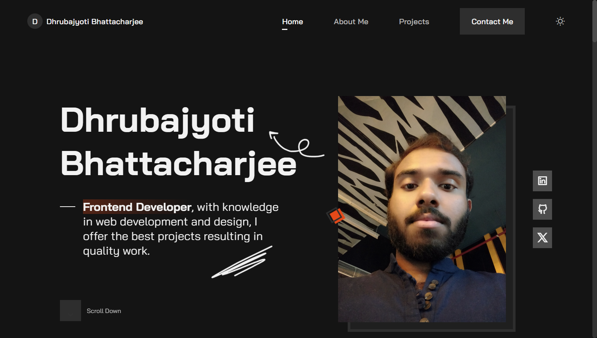

# Dhrubajyoti Bhattacharjee | Frontend Developer Portfolio

Professional portfolio website showcasing modern web development skills and projects. Built with vanilla JavaScript, HTML5, CSS3, and powered by Vite for optimal performance.



## Features

- **Responsive Design** - Fully responsive across all device sizes
- **Real-time Form Validation** - Contact form with live validation feedback
- **Dark/Light Theme Toggle** - User preference theme switching
- **Smooth Animations** - ScrollReveal.js powered animations
- **EmailJS Integration** - Working contact form without backend
- **Performance Optimized** - Fast loading with Vite build system
- **SEO Optimized** - Proper meta tags and semantic HTML

## Technologies Used

- **Frontend**: HTML5, CSS3, JavaScript ES6+
- **Build Tool**: Vite
- **Animations**: ScrollReveal.js
- **Form Handling**: EmailJS
- **Icons**: Remix Icons
- **Fonts**: Google Fonts (Bai Jamjuree)

## Technical Highlights

- Modular JavaScript architecture with ES6+ modules
- CSS custom properties for consistent theming
- Form validation with real-time feedback on blur events
- Intersection Observer API for scroll-based navigation
- Mobile-first responsive design approach
- Semantic HTML for accessibility

## Live Demo

Visit the live site: [https://math-to-dev.vercel.app/](https://math-to-dev.vercel.app/)

## Local Development

1. Clone the repository

```bash
git clone https://github.com/KeepSerene/my-1st-portfolio-site.git
cd my-1st-portfolio-site
```

2. Install dependencies

```bash
npm install
```

3. Start development server

```bash
npm run dev
```

4. Build for production

```bash
npm run build
```

## Project Structure

```
├── src/
│   ├── css/
│   │   ├── components/    # Component-specific styles
│   │   ├── style.css      # Global styles and variables
│   │   └── utils.css      # Utility classes
│   └── js/
│       ├── email-js.js           # EmailJS integration
│       ├── form-validation.js    # Form validation logic
│       ├── main.js              # Main entry point
│       └── [other modules]
├── public/               # Static assets
└── index.html           # Main HTML file
```

## Contact

- **LinkedIn**: [Dhrubajyoti Bhattacharjee](https://www.linkedin.com/in/dhrubajyoti-bhattacharjee-320822318/)
- **GitHub**: [@KeepSerene](https://github.com/KeepSerene)
- **Twitter/X**: [@UsualLearner](https://x.com/UsualLearner)

## Author

**Dhrubajyoti Bhattacharjee** - Frontend Developer specializing in React.js, Next.js, Node.js, and modern web technologies.

---

Built with care and attention to detail. Open to feedback and collaboration opportunities.
